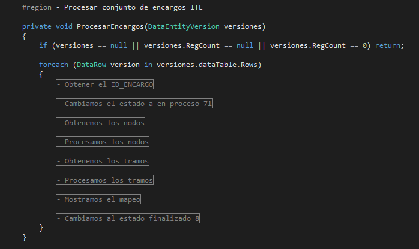

# Servicio de integración con RedBT

### Introducción

El servicio de integración con RedBT se encarga de obtener todas las modificaciones que se realizan en ***SOTER***, en la sección de **ITE**, y agregarlas a la BBDD de RedBT.

### Proceso
El proceso es un Daemon instalado en el servidor que cada 15sg busca en las entidades de fieldeas si hay encargos/versiones para procesar. El proceso realiza las siguientes operaciones:


<div align="center">Procesar versiones.</div>

##### Obtener el ID_Encargo
Se encarga de obtener el ID_ENCARGO de cada uno de los encargos que se tienen que procesar. El ID_ENCARGO es muy importante porque es parte de las claves primarias de la mayoria de las entidades.

Si no se obtiene el ID_ENCARGO, la versión no se procesa.

#### Cambiar el estado a en proceso (71)
En este momento la versión que se está procesando se avanza de estado, por si el tiempo de procesado es mayor de 15sg no vuelva a tratar la misma versión.
## Nodos
#### Obtener los Nodos
Una vez obtenido el ID_ENCARGO se buscan en las entidades de fieldeas todos los nodos que sufran modificaciones y se trata cada modificación en un objeto DataEntityVersion diferente, para Insert, Update y Delete.  
```
DataEntityVersion nodosInsert = _mApi.GetData(entidadVersion, filtro);
DataEntityVersion nodosUpdate = _mApi.GetData(entidadVersion, filtro);
DataEntityVersion nodosDelete = _mApi.GetData(entidadVersion, filtro);
```

#### Procesar los Nodos
En cada objeto están los nodos a tratar y se procesa cada objeto por separado.

<!---->

<p align="center">
  
  <div align="center">Procesar Nodos.</div>
</p>

###### Insertar Nodos
```
//Función que inserta un nuevo nodo en RedBT
public void InsertNodoRedBT(DataRow nodo)
{
   //1º Se genera el objeto base del nodo

   //2º Se obtiene el tipo del nodo, para buscar en su entidad

   //3º Obtengo la clave de seguridad

   //4º Llamo a RedBt para almacenar

   //5º Mapeo el ID que me retorna RedBT
}
```
###### Actualizar Nodos
```
//Función que actualiza un nodo en RedBT
public void UpdateNodoRedBT(DataRow nodo)
{
   //1º Se genera el objeto base del nodo

   //2º Busco el ID de GeoDB

   //3º Se obtiene el tipo del nodo, para buscar en su entidad

   //4º Obtengo la clave de seguridad

   //5º Llamo a RedBt para actualizar        
}

```
###### Borrar Nodos
```
//Función que borra un nodo en RedBT
public void DeleteNodoRedBT(DataRow nodo)
{
    //1º Se genera el objeto base del nodo

    //2º Busco el ID de GeoDB en el mapeo

    //3º Obtengo la clave de seguridad        

    //4º Llamo a RedBt para borrar                  
}
```
## Tramos
#### Obtener los Tramos
Una vez procesado los Nodos se buscan en las entidades de fieldeas todos los tramos que sufran modificaciones y se trata cada modificación en un objeto DataEntityVersion diferente, para Insert, Update y Delete.  
```
DataEntityVersion tramosInsert = _mApi.GetData(entidadVersion, filtro);
DataEntityVersion tramosUpdate = _mApi.GetData(entidadVersion, filtro);
DataEntityVersion tramosDelete = _mApi.GetData(entidadVersion, filtro);
```

#### Procesar los Tramos
En cada objeto están los tramos a tratar y se procesa cada objeto por separado.

<!---->

<p align="center">
  
  <div align="center">Procesar Tramos.</div>
</p>

###### Insertar Tramos
```
//Función que inserta un nuevo tramo en RedBT
public void InsertTramoRedBT(DataRow tramo)
{
    //1º Se genera el objeto base del tramo;                

    //2º Busco los ID de los extremos
        //Se sustituyen los ID

    //3º Obtengo la clave de seguridad

    //4º Llamo a RedBt para almacenar

    //5º Mapeo el ID que me retorna RedBT
    }
}
```
###### Actualizar Tramos
```
//Función que actualiza un tramo en RedBT
public void UpdateTramoRedBT(DataRow tramo)
{
    //1º Se genera el objeto base del tramo

    //2º Busco el ID de GeoDB
        //Se sustituyen los ID

    //3º Obtengo la clave de seguridad

    //4º Llamo a RedBt para actualizar
}
```
###### Borrar Tramos
```
//Función que borra un nodo en RedBT
public void DeleteTramoRedBT(DataRow tramo)
{
    //1º Se genera el objeto base del tramo

    //2º Busco el ID de GeoDB en el mapeo

    //3º Obtengo la clave de seguridad

    //4º Llamo a RedBt para borrar
}
```
