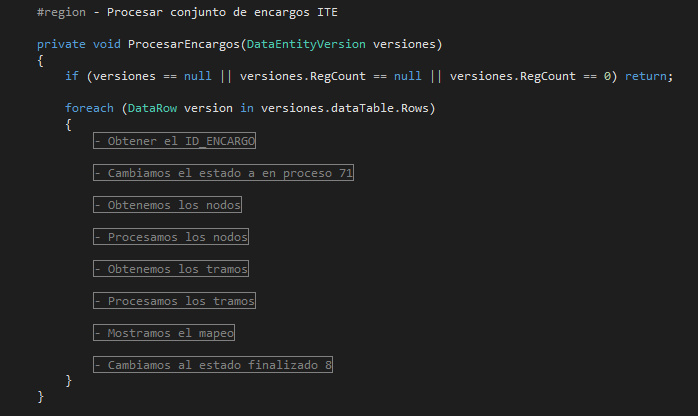

# markdown-test
This repository try to practice with Markdown files

# Servicio de integración con RedBT

### Introducción

El servicio de integración con RedBT se encarga de obtener todas las modificaciones que se realizan en ***SOTER***, en la sección de **ITE**, y agregarlas a la BBDD de RedBT. 

### Proceso

El proceso del servicio hace: 

